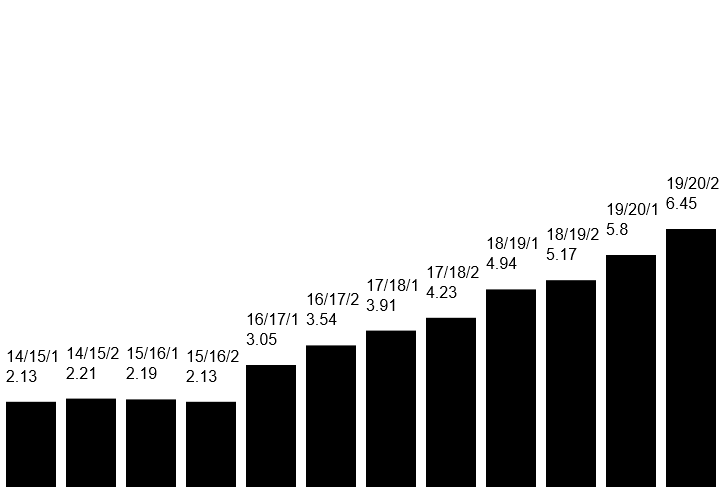

# 5. Gyakorlat feladatok
## 1. Feladat - Katalógus
### Lore
Tisztában vagyunk vele, hogy a katalógus megkérdőjelezhetetlenül javítja a jegyeket - de mennyire? Nagyon. Viszont ez a válasz valamiért nem elég a kötekedő hallgatóknak, így, hogy bizonyítsuk az abszolút igazunkat, számokra fogjuk alapozni érveinket, és megdönthetetlen bizonyítékkal állunk a szkeptikusok elé.

### Feladat
Készíts egy oldalt, ami képes kirajzolni a féléves kreditindex adatokat egy oszlopgrafikonra Canvas segítségével!  
Az adatok félévenként vannak megadva. Minden félév egyforma szélesen, kisebb térközzel legyen egy oszlopgrafikonon ábrázolva, és a tetejükre legyen feliratozva, hogy melyik félévről beszélünk, és hogy mi a pontos érték!  
A program működjön akkor is, ha más adatokat adunk meg neki, tehát az adatokból generáld, ne beleégesd a Canvas kódjába!

### Példa


### Induló kód
Az oszlopok magassága maradjon arányos, de nyújthatod őket konstans szorzóval.  
Érdemes a `fillRect` függvényt használni. Dokumentáció: [https://www.w3schools.com/tags/canvas_fillrect.asp](https://www.w3schools.com/tags/canvas_fillrect.asp)
````JS
[
    {
        felev: '14/15/1',
        atlag: 2.13
    },
    {
        felev: '14/15/2',
        atlag: 2.21
    },
    {
        felev: '15/16/1',
        atlag: 2.19
    },
    {
        felev: '15/16/2',
        atlag: 2.13
    },
    {
        felev: '16/17/1',
        atlag: 3.05
    },
    {
        felev: '16/17/2',
        atlag: 3.54
    },
    {
        felev: '17/18/1',
        atlag: 3.91
    },
    {
        felev: '17/18/2',
        atlag: 4.23
    },
    {
        felev: '18/19/1',
        atlag: 4.94
    },
    {
        felev: '18/19/2',
        atlag: 5.17
    },
    {
        felev: '19/20/1',
        atlag: 5.80
    },
    {
        felev: '19/20/2',
        atlag: 6.45
    }
]
````